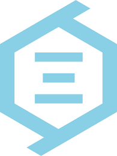

### Hi! I'm Adrian Fernandez 👋

<!--
**afdezcl/afdezcl** is a ✨ _special_ ✨ repository because its `README.md` (this file) appears on your GitHub profile.

Here are some ideas to get you started:

- 🔭 I’m currently working on ...
- 🌱 I’m currently learning ...
- 👯 I’m looking to collaborate on ...
- 🤔 I’m looking for help with ...
- 💬 Ask me about ...
- 📫 How to reach me: ...
- 😄 Pronouns: ...
- ⚡ Fun fact: ...
-->

## :book: 𝙰𝚋𝚘𝚞𝚝 𝙼𝚎
- 🖥 I'm a front-end engineer.
- 💼 I'm a head of front-end at Genengine  and co-founder of KEMENU 
- 🎓 I've studied Computer Engenieering at University of Malaga.

## ⚡ Technologies

## 📫 𝙷𝚘𝚠 𝚝𝚘 𝚛𝚎𝚊𝚌𝚑 𝚖𝚎:

